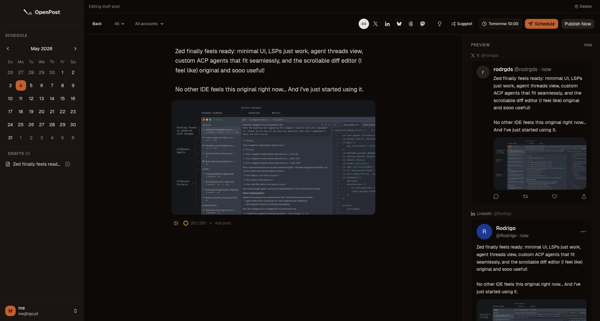

<p align="center">
  <a href="https://github.com/rodrgds/openpost">
    
  </a>
</p>

<p align="center">
  <a href="https://github.com/rodrgds/openpost/releases">
    
  </a>
  <a href="https://github.com/rodrgds/openpost/pkgs/container/openpost">
    
  </a>
  <a href="https://github.com/rodrgds/openpost/actions/workflows/ci.yml">
    
  </a>
  <a href="LICENSE">
    
  </a>
  <a href="SECURITY.md">
    
  </a>
</p>

<div align="center">
  <strong>
    <h2>A lightweight, self-hosted social media scheduler</h2>
  </strong>
  Post to X, Mastodon, Bluesky, Threads, and LinkedIn from your own server.<br/>
  One binary or container. Your data stays on your machine.
</div>

<div align="center">
  <br/>
  <picture>
    <source media="(prefers-color-scheme: dark)" srcset="./assets/logos/x-white.svg">
    
  </picture>
  &nbsp;
  <picture>
    <source media="(prefers-color-scheme: dark)" srcset="./assets/logos/mastodon-white.svg">
    
  </picture>
  &nbsp;
  <picture>
    <source media="(prefers-color-scheme: dark)" srcset="./assets/logos/bluesky-white.svg">
    
  </picture>
  &nbsp;
  <picture>
    <source media="(prefers-color-scheme: dark)" srcset="./assets/logos/threads-white.svg">
    
  </picture>
  &nbsp;
  <picture>
    <source media="(prefers-color-scheme: dark)" srcset="./assets/logos/linkedin-white.svg">
    
  </picture>
</div>

<p align="center">
  <br/>
  <a href="https://op.rgo.pt/"><strong>Documentation</strong></a>
  ·
  <a href="https://op.rgo.pt/guide/quickstart"><strong>Quickstart</strong></a>
  ·
  <a href="https://github.com/rodrgds/openpost/releases"><strong>Releases</strong></a>
</p>

<p align="center">
  
</p>

## Why OpenPost

- Self-hosted: your data stays on your server.
- Single binary or container: no Redis, no Postgres, no external queue.
- SQLite-backed scheduling: queued posts survive restarts.
- Multi-platform publishing: X, Mastodon, Bluesky, Threads, and LinkedIn.
- Encrypted tokens: OAuth tokens are encrypted at rest with AES-256-GCM.
- Thread support: publish multi-post threads in sequence.

## Quickstart

```bash
cp backend/.env.example .env
docker compose up -d
```

Set fresh values for `OPENPOST_JWT_SECRET` and `OPENPOST_ENCRYPTION_KEY` before using OpenPost outside local testing. The first account created on an instance becomes the instance admin automatically. For the full install path, reverse proxy setup, provider OAuth guides, and operations docs, use the docs site.

## Supported Platforms

- X
- Mastodon
- Bluesky
- Threads
- LinkedIn

## Documentation

- [Landing and docs site](https://op.rgo.pt/)
- [Quickstart](https://op.rgo.pt/guide/quickstart)
- [Installation](https://op.rgo.pt/installation/docker-compose)
- [Configuration](https://op.rgo.pt/configuration/environment-variables)
- [Providers](https://op.rgo.pt/providers/overview)
- [Operations](https://op.rgo.pt/operations/troubleshooting)
- [Development](https://op.rgo.pt/development/setup)

## Contributing

Use the development docs in the documentation site, the repo guidance in `AGENTS.md`, and the existing code patterns in `frontend/` and `backend/`.

## Security

Report security issues through [SECURITY.md](SECURITY.md).

## License

MIT
